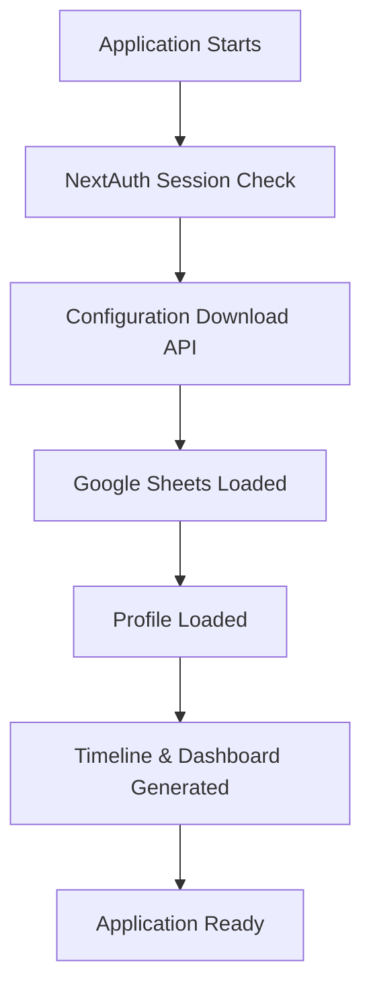
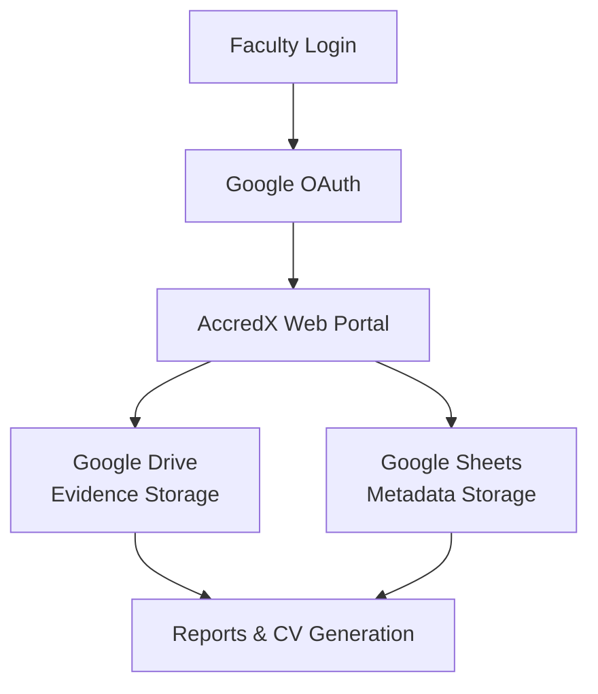

<div align="center">
  <h1>AccredX</h1>
  <p><strong>The Comprehensive Faculty Accreditation & Evidence Management Portal</strong></p>
  <p>
    <a href="https://nextjs.org/"></a>
    <a href="https://reactjs.org/"></a>
    <a href="https://www.typescriptlang.org/"></a>
    <a href="https://tailwindcss.com/"></a>
  </p>
</div>

---

## 📖 README Philosophy

This README is not a simple GitHub landing page. It is the **complete operating manual** and **definitive AI knowledge base** for the AccredX project. 

Whether you are a faculty member installing the app, a developer contributing code, a mentor reviewing architecture, or an **AI Coding Assistant** continuing development, you will find everything you need to understand, configure, maintain, and extend AccredX entirely within this document.

---

## 🎯 Project Objectives

AccredX exists to solve systemic issues in faculty documentation. The project aims to:
- **Eliminate scattered academic evidence** by providing a single, unified repository.
- **Reduce time spent** preparing accreditation reports (NBA, NAAC, PMS).
- **Automatically organize** faculty documents in cloud storage.
- **Generate institutional documents** (like CVs and compliance summaries) from a single source of truth.
- **Maintain complete faculty ownership** of data by utilizing personal Google accounts.
- **Minimize manual work** during academic audits.

---

## 🧠 Core Design Principles

The philosophy driving AccredX relies on simplicity, ownership, and flexibility:
- **Local-First Architecture:** The application runs locally on the faculty member's system. There is no central server hoarding user data.
- **Google Sheets as the Single Source of Truth:** Metadata, configuration, and records are stored in Google Sheets, ensuring transparency and ease of manual edits.
- **Google Drive for Evidence Storage:** Provides free, highly reliable, user-owned storage for large files.
- **Dynamic Configuration Over Hardcoded Logic:** Categories, activity types, and form fields are fetched dynamically from Sheets.
- **Reusable Metadata:** Data entered once can be repurposed for Timelines, Reports, and CV generation.
- **Minimal Manual Intervention:** Automated folder creation and document parsing.
- **Human + AI Friendly:** Designed to be easily understood by faculty and extensible by AI assistants.

---

## 🔐 Data Ownership

A strict architectural rule of AccredX is absolute data sovereignty. 
- **Faculty Owns Everything:** The faculty member owns their Google Account, Google Drive, Google Sheets, and OAuth credentials.
- **No External Servers:** AccredX does not send telemetry, analytics, or user data to any external centralized database.
- **Zero Lock-In:** Because data is stored in standard Google Sheets and Drive folders, faculty can always access their information even without the AccredX application.

---

## 🚀 Application Lifecycle

Understanding what happens when AccredX is launched helps clarify the system's architecture.



1. **Application Starts:** User visits `http://localhost:3000`.
2. **NextAuth Session Check:** App verifies active Google session.
3. **Configuration Download:** `/api/config` fetches dynamic categories and mappings from the Config Sheet.
4. **Google Sheets Loaded:** App connects to Google Sheets API using OAuth tokens.
5. **Profile Loaded:** Faculty profile and historical activities are pulled into memory.
6. **Timeline Generated:** The UI renders chronological evidence.
7. **Application Ready:** User can interact with all modules.

---

## 🏗️ System Architecture & Data Flow



### Data Flow Diagrams

**Profile to Document Flow:**
`Profile Setup` ➔ `Google Sheets (Profile Sheet)` ➔ `Dashboard` ➔ `Somaiya CV` ➔ `PDF Export`

**Activity to Evidence Flow:**
`Add Activity UI` ➔ `Metadata mapped to JSON` ➔ `File uploaded to Drive` ➔ `Metadata saved to Sheets` ➔ `Timeline / Reports Generated`

---

## 🧩 Application Modules

### 1. Dashboard
- **Purpose:** Central landing page showing quick stats, recent activities, and navigation.
- **Features:** Summary metrics, quick action buttons.
- **Inputs:** Google Sheets (Activities).
- **Connected APIs:** None directly (uses cached local state fetched on load).

### 2. Add Faculty Activity
- **Purpose:** The primary input form for recording academic achievements.
- **Features:** Dynamic form fields based on selected PMS category, file upload support, link attachments.
- **Inputs:** Form data, File blobs.
- **Outputs:** Pushes data to Google Sheets, pushes files to Google Drive.
- **Google Sheets:** Writes to the `Activities` sheet.
- **Google Drive:** Creates folders and uploads evidence files.

### 3. Timeline
- **Purpose:** Visual chronological representation of all academic work.
- **Features:** Filtering by year/category, clickable evidence links.
- **Inputs:** Google Sheets (Activities).

### 4. Reports
- **Purpose:** Automated generation of compliance documents.
- **Features:** PMS Summaries, NBA reports, aggregated statistics.
- **Inputs:** Google Sheets (Activities, Profile).
- **Outputs:** On-screen tables, exportable CSV/PDFs.

### 5. Profile
- **Purpose:** Manage personal and professional details.
- **Features:** Avatar upload, bio, education history, job title.
- **Inputs/Outputs:** Reads/Writes to the `Profile` Google Sheet.

### 6. Somaiya CV / Resume Generator
- **Purpose:** Instantly format data into standardized institutional CVs or modern resumes.
- **Features:** Live preview, print-to-PDF.
- **Inputs:** Aggregates data from `Profile` and `Activities` sheets.

### 7. Course Activity Hub
- **Purpose:** Dedicated workspace for managing semester-wise course materials.
- **Features:** Organized by Academic Year ➔ Semester ➔ Course. Mixes cloud files and external URLs.
- **Inputs/Outputs:** Google Drive folder management, Google Sheets metadata tracking.

### 8. Admin Dashboard
- **Purpose:** Data management and system configuration.
- **Features:** Edit/Delete records, manage configuration schemas.
- **Inputs/Outputs:** Direct read/write access to all Google Sheets. Restricted to `ADMIN_EMAILS`.

### 9. AI Assistant (Gemini Gem)
- **Purpose:** Provide contextual help, answer setup queries, and guide users on how to map activities.
- **Features:** Opened via the "Help" button in the header.
- **Limitations:** It is an external Google Gem; it does not have direct API access to the codebase or the user's private data.
- **Privacy:** No API keys required in AccredX. It runs using the faculty's personal Google account session.

---

## 🗄️ Google Sheets Schema (The Database)

AccredX treats Google Sheets as a relational database. It relies on the following schema structures:

### Sheet: `Activities`
*Stores all faculty activities and achievements.*

| Column | Purpose |
|---|---|
| `Activity ID` | Unique identifier (Timestamp/UUID) |
| `Timestamp` | Record creation time |
| `Faculty Email` | Identifies ownership of the record |
| `PMS Category` | High-level categorization (e.g., Research) |
| `Activity Type` | Specific activity (e.g., Scopus Publication) |
| `Metadata JSON` | Stringified JSON of dynamic form fields (e.g., `{"journal":"Nature","impact": 5}`) |
| `Drive File URL` | Link to the uploaded evidence in Google Drive |

### Sheet: `Profile`
*Stores faculty biographical data.*

| Column | Purpose |
|---|---|
| `Email` | Primary Key |
| `Full Name` | Display name |
| `Designation` | Academic title |
| `Department` | Associated department |
| `Bio` | Short biography |
| `Profile Photo URL`| Link to avatar |

### Sheet: `Config`
*Stores the dynamic schema for the application.*

| Column | Purpose |
|---|---|
| `Key` | Configuration identifier (e.g., `pms_categories`) |
| `Value JSON` | Stringified JSON of schema arrays |

---

## 📁 Google Drive Behaviour

AccredX automatically orchestrates Google Drive to prevent clutter. 

- **Folder Creation:** The app checks if a folder exists before creating it (Duplicate Prevention). 
- **Hierarchy:** 
  `AccredX Repository` ➔ `[Academic Year]` ➔ `[Category / Course]` ➔ `[Evidence Files]`
- **Duplicate Prevention:** Uses Drive search queries (`q: name='folder' and trashed=false`) to reuse existing folders.
- **File Uploads:** Files are uploaded directly to the specific sub-folder, bypassing the root drive.
- **Link Uploads:** External links (e.g., YouTube videos, publisher URLs) are saved in the Sheets metadata without creating Drive files.
- **Evidence Deletion:** When an activity is deleted via the Admin dashboard, the app flags the Drive file as trashed.

---

## 🎛️ State Management

State in AccredX is highly deliberate:
- **Source of Truth:** Google Sheets.
- **Server State:** Fetched via Next.js API routes (`/api/activities`) and passed to components.
- **Client State (React):** `useState` and React Context are used *only* for UI toggles, modal states, and form drafts.
- **Local Storage:** Strictly used for caching configurations to speed up initial render (`localDb.ts`). 
- **Security Rule:** Sensitive tokens, complete profiles, and bulk data are *never* stored persistently in Local Storage.

---

## 🌐 Complete API Inventory

All interactions with Google APIs are abstracted behind Next.js API Routes.

| Route | Method | Purpose | Google API Used |
|---|---|---|---|
| `/api/auth/[...nextauth]` | GET/POST | Handle Google Login & Sessions | Google OAuth2 |
| `/api/config` | GET | Fetch dynamic schema rules | Google Sheets API |
| `/api/activities` | GET | Retrieve user timeline records | Google Sheets API |
| `/api/activities` | POST | Create new activity record | Google Sheets API |
| `/api/activities` | DELETE | Remove record | Google Sheets API |
| `/api/upload` | POST | Stream file to Drive | Google Drive API |
| `/api/profile` | GET/POST | Manage user profile data | Google Sheets API |

---

## ⚙️ Environment Variables

These variables must be configured in `.env.local`:

| Variable | Required | Purpose | Example |
|---|---|---|---|
| `GOOGLE_CLIENT_ID` | Yes | OAuth authentication identifier | `12345...apps.googleusercontent.com` |
| `GOOGLE_CLIENT_SECRET` | Yes | OAuth authentication secret | `GOCSPX-abcdef...` |
| `NEXTAUTH_URL` | Yes | Base URL for auth callbacks | `http://localhost:3000` |
| `NEXTAUTH_SECRET` | Yes | Encryption key for session cookies | `super_secret_random_string` |
| `ADMIN_EMAILS` | Yes | Comma-separated list of emails with Admin access | `john@example.com,admin@example.com` |

---

## 📂 Folder Structure Conventions

```text
accredx/
├── public/               # Static assets (images, icons)
├── src/
│   ├── app/              # Next.js App Router (Pages & API Routes)
│   │   ├── api/          # Server-side API endpoints wrapping Google APIs
│   │   └── (routes)/     # UI Page components
│   ├── components/       # Reusable React UI components (Buttons, Modals, Forms)
│   ├── data/             # Static fallbacks and local cache references
│   ├── lib/              # Core business logic (Drive helpers, Sheets parsers, Config stores)
│   ├── types/            # TypeScript interface definitions
│   └── styles/           # Global Tailwind CSS styles
```

---

## 🛠️ Technologies Used

- **Next.js (App Router):** Chosen for its seamless blending of frontend React and backend API routes, allowing the app to run entirely local without a separate backend server.
- **React:** For a dynamic, component-driven UI.
- **TypeScript:** Enforces strict typing, significantly reducing runtime errors, especially when parsing unpredictable Google Sheets data.
- **Tailwind CSS:** Utility-first styling for rapid, responsive, and consistent UI design without bloated CSS files.
- **NextAuth.js:** Chosen because it flawlessly handles Google OAuth securely out-of-the-box.
- **Googleapis (Node.js SDK):** The official library for interacting with Drive and Sheets APIs.

---

## 🚦 Developer Checklist

For future human contributors and AI assistants, adhere to this checklist before committing code:
- [ ] **Preserve backward compatibility.** Old metadata JSON structures in Google Sheets must still parse correctly.
- [ ] **Don't break Google Sheets schema.** Appending columns is fine; deleting or renaming columns will corrupt existing user data.
- [ ] **Keep Google Sheets as the Source of Truth.** Do not introduce PostgreSQL, MongoDB, or SQLite.
- [ ] **Don't hardcode configurations.** If adding a new Activity type, add it to the Config Sheet, not the UI components.
- [ ] **Verify Drive permissions.** Ensure newly added upload features pass the correct parent folder IDs.

---

## 📝 Coding Standards

- **Component Naming:** PascalCase for files and functions (e.g., `ActivityCard.tsx`).
- **Folder Conventions:** Feature-based grouping in `/components`.
- **TypeScript:** Avoid `any`. Use strict interfaces defined in `/types`.
- **API Conventions:** APIs must validate session tokens via `getServerSession` before executing Google API calls.
- **Tailwind:** Group utility classes logically (layout ➔ spacing ➔ typography ➔ colors).

---

## 🌿 Repository Conventions

- **Branching:** Use `feature/feature-name` or `bugfix/issue-description`.
- **Commit Messages:** Imperative mood. (e.g., "Add course hub module", not "Added course hub").
- **Pull Requests:** Must include a description of changes and confirm that local testing with a fresh Google Sheet was successful.
- **Merge Policy:** Squash and merge to `main`.

---

## ⚡ Performance Optimization

AccredX remains fast despite relying on cloud APIs:
- **Google Sheets Caching:** (`localDb.ts`) caches data locally to provide instant UI renders while background fetching updates.
- **Config Synchronization:** `configStore.ts` loads schemas once at startup and distributes them via React state.
- **Drive Folder Reuse:** Drive IDs are cached to prevent redundant search queries during bulk uploads.
- **Lazy Loading:** Next.js dynamic imports are used for heavy charts and PDF generation libraries.

---

## 🔮 Future Integrations & Roadmap

Beyond the current scope, AccredX is designed to support:
- **Faculty Portfolio Website:** One-click generation of a public-facing academic portfolio.
- **LMS Integration:** Direct fetching of course records from Moodle or Google Classroom.
- **AI Document Classifier:** Auto-categorization of uploaded PDFs.
- **OCR (Optical Character Recognition):** Extracting text from scanned certificates for automated metadata entry.
- **Institution-wide Deployment:** A SaaS tier with Role-Based Access Control (RBAC) and Dean/HOD dashboards.

---

## 📚 Glossary

- **PMS:** Performance Management System.
- **NBA:** National Board of Accreditation.
- **NAAC:** National Assessment and Accreditation Council.
- **FDP:** Faculty Development Program.
- **STTP:** Short Term Training Program.
- **Evidence:** Supporting documents (PDFs, Images, Links) proving an activity occurred.
- **Metadata:** The specific details of an activity (e.g., Date, Title, Journal Name) stored as JSON in Sheets.
- **Course Mapping:** Linking evidence directly to a specific subject taught in a semester.

---

## 🤖 AI Development Guide

> **IMPORTANT**: This section serves as a permanent system prompt for any AI Coding Assistant (Antigravity, Claude, Cursor, Copilot, etc.) working on AccredX.

**AI Context Instructions:**
1. **Architecture:** AccredX is a local-first Next.js application. There is NO traditional database. 
2. **Database:** **Google Sheets is the ONLY database.** Never write code to initialize SQLite, Prisma, MongoDB, or any other DB.
3. **Storage:** **Google Drive stores ONLY evidence files.** Metadata is stored in Sheets.
4. **State:** UI State is in React. Server state is fetched from Sheets.
5. **Configuration:** Prefer dynamic configuration. If a user asks to "Add a new activity called 'Guest Lecture'", instruct them to update their Config Sheet rather than hardcoding it into `pmsMapping.ts`.
6. **Backward Compatibility:** Metadata schemas evolve. Always use optional chaining (`?.`) when parsing `metadata JSON` from Sheets, as older rows may lack newer fields.
7. **Workflows:** Preserve existing faculty workflows. Do not remove the Timeline, Reports, or CV generation modules unless explicitly instructed by the user.
8. **Dependencies:** Minimize new NPM packages. Use native browser APIs and standard Tailwind utilities wherever possible.

---

## 🛠️ Installation & Setup Guide

This guide is written for faculty members to set up AccredX on their personal machines. No advanced coding knowledge is required.

### Prerequisites
1. **Node.js:** Download and install Node.js (Version 18 or higher) from [nodejs.org](https://nodejs.org).
2. **Google Account:** You need a standard Google Account (Gmail or Institutional Workspace).

### Step 1: Obtain Google API Keys
AccredX needs permission to save files to your Google Drive and write text to your Google Sheets.
1. Go to the [Google Cloud Console](https://console.cloud.google.com).
2. Click **Select a project** (top left) ➔ **New Project**. Name it "AccredX Local" and click Create.
3. Go to **APIs & Services ➔ Library**.
4. Search for **Google Drive API** and click **Enable**.
5. Search for **Google Sheets API** and click **Enable**.
6. Go to **APIs & Services ➔ OAuth consent screen**.
   - Choose **External** and click Create.
   - Fill in App Name ("AccredX") and your email address. Save and Continue.
7. Go to **APIs & Services ➔ Credentials**.
   - Click **Create Credentials ➔ OAuth client ID**.
   - Application Type: **Web application**.
   - Under **Authorized redirect URIs**, add exactly: 
     `http://localhost:3000/api/auth/callback/google`
   - Click Create. 
8. You will see your **Client ID** and **Client Secret**. Keep this window open.

### Step 2: Download the Application
Open your computer's Terminal (or Command Prompt) and run:
```bash
git clone https://github.com/yourusername/accredx.git
cd accredx
```

### Step 3: Install Dependencies
In the same terminal, run:
```bash
npm install
```

### Step 4: Configure the Application
In the `accredx` folder, duplicate the `.env.example` file and rename it to `.env.local`. Open it in any text editor and fill it out:

```env
# Paste the keys you got from Google Cloud
GOOGLE_CLIENT_ID="your_google_client_id_here"
GOOGLE_CLIENT_SECRET="your_google_client_secret_here"

# Do not change this
NEXTAUTH_URL="http://localhost:3000"

# Generate any random password string here (e.g., "my_secure_accredx_key_123")
NEXTAUTH_SECRET="your_random_secret_string"

# Add your email address to get Admin Dashboard access
ADMIN_EMAILS="your_email@gmail.com"
```

### Step 5: Start AccredX
Run the application:
```bash
npm run dev
```
Open your web browser and navigate to [http://localhost:3000](http://localhost:3000). Click "Sign in with Google" to begin!

---

## ⚠️ Troubleshooting Guide

- **Error: `redirect_uri_mismatch` on Login**
  - Fix: Ensure you added exactly `http://localhost:3000/api/auth/callback/google` in the Google Cloud Console Redirect URIs.
- **Error: `Insufficient Permissions` when uploading**
  - Fix: Ensure both Google Drive API and Google Sheets API are enabled in Google Cloud Console.
- **Port 3000 is already in use**
  - Fix: Run `npm run dev -- -p 3001` and update your `NEXTAUTH_URL` and Google Cloud Redirect URI to use port 3001.

---

## 📸 Screenshots

<details>
<summary><b>Dashboard</b></summary>
<br>
<i>
</i>
</details>

<details>
<summary><b>Course Activity Hub</b></summary>
<br>
<i>
</i>
</details>

<details>
<summary><b>Timeline View</b></summary>
<br>
<i>
</i>
</details>

<details>
<summary><b>Automated Reports</b></summary>
<br>
<i>
</i>
</details>

<details>
<summary><b>Somaiya CV Preview</b></summary>
<br>
<i>
</i>
</details>

---

## 📄 License

This project is licensed under the MIT License.
