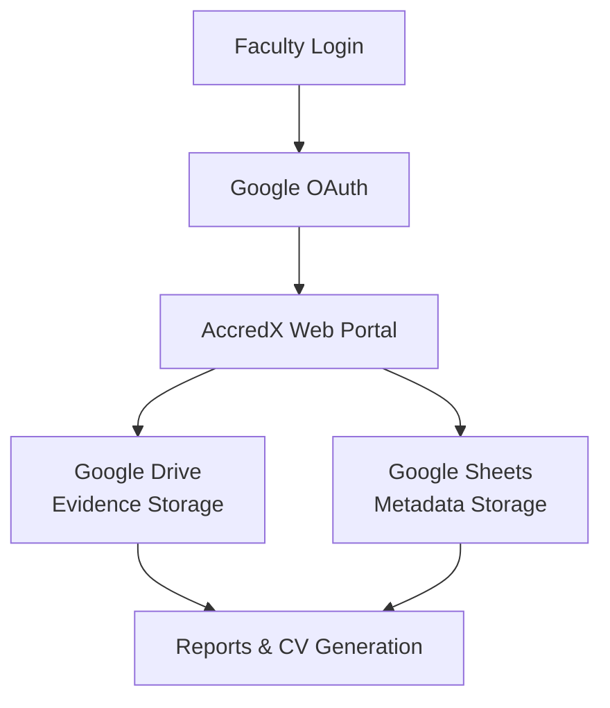

<div align="center">
  <h1>AccredX</h1>
  <p><strong>Faculty Accreditation & Evidence Management Portal</strong></p>
  <p>
    <a href="https://nextjs.org/"></a>
    <a href="https://reactjs.org/"></a>
    <a href="https://www.typescriptlang.org/"></a>
    <a href="https://tailwindcss.com/"></a>
  </p>
  <p>AccredX is a centralized, streamlined portal designed to simplify the management of faculty accreditation, evidence collection, and professional documentation.</p>
</div>

---

## 🎯 Problem Statement

Faculty members often face significant challenges when managing academic documentation:

- **Disorganized Evidence:** Maintaining accreditation evidence across scattered folders, local drives, and emails.
- **Complex Reporting:** Compiling PMS (Performance Management System), NBA, and NAAC documentation is time-consuming and manual.
- **Course Record Management:** Organizing course-related records semester by semester lacks a unified system.
- **Profile Building:** Preparing and updating academic CVs requires constant aggregation of disparate data.

AccredX solves this by providing a unified platform to centralize, track, and generate insights from faculty activities.

---

## 💡 Solution

AccredX is a comprehensive portal tailored for faculty members and academic institutions. It offers:

- **Seamless Authentication:** Secure login using Google Authentication.
- **Centralized Repository:** A single hub for all academic and accreditation evidence.
- **Structured Activity Management:** Dedicated Course Activity Hub and PMS Activity Tracking.
- **Visual Timelines:** Intuitive timeline views to track academic progress and submissions.
- **Automated Reporting:** Effortless generation of PMS reports, NBA summaries, and Annual reports.
- **CV Generation:** One-click Somaiya CV generation based on integrated profiles.
- **Cloud Integration:** Deep integration with Google Drive for storage and Google Sheets for metadata.

---

## ✨ Features

### Faculty Activity Management
| Feature | Description |
|---|---|
| **Activity Upload** | Easily log academic, research, and extracurricular activities. |
| **Evidence Upload** | Attach supporting documents and links directly to activities. |
| **PMS Categorization** | Automatically categorize activities per PMS requirements. |
| **Timeline Tracking** | Visualize faculty contributions chronologically. |

### Course Activity Hub
| Feature | Description |
|---|---|
| **Course-wise Storage** | Dedicated spaces for each course taught. |
| **Semester Organization** | Group courses and evidence by academic semesters. |
| **Category Management** | Classify evidence based on accreditation standards. |
| **Link & File Support** | Mix cloud files and external URLs effortlessly. |

### Automated Reports & CV
| Feature | Description |
|---|---|
| **Compliance Reports** | Generate PMS Reports, NBA Summaries, and Annual Reports. |
| **Somaiya CV** | Live preview and generation of professional academic CVs. |
| **Profile Integration** | Automatically pull details from your unified profile. |

### Smart Repository Management
| Feature | Description |
|---|---|
| **Auto-Folders** | Automatic folder creation and organization in Google Drive. |
| **Cloud Storage** | Secure, scalable storage using Google Drive API. |
| **Metadata Sync** | Fast and structured data retrieval using Google Sheets. |

---

## 🏗️ System Architecture



---

## 🛠️ Tech Stack

**Frontend:**
- [Next.js](https://nextjs.org/)
- [React](https://reactjs.org/)
- [TypeScript](https://www.typescriptlang.org/)
- [Tailwind CSS](https://tailwindcss.com/)

**Authentication:**
- [NextAuth.js](https://next-auth.js.org/)
- Google OAuth

**Backend:**
- Next.js API Routes

**Storage & Integrations:**
- Google Drive API
- Google Sheets API

**Deployment:**
- [Vercel](https://vercel.com/)

---

## 📂 Folder Structure

```text
accredx/
├── public/               # Static assets
├── src/
│   ├── app/              # Next.js App Router (Pages & API Routes)
│   ├── components/       # Reusable React components
│   ├── lib/              # Utility functions and API clients
│   ├── types/            # TypeScript type definitions
│   └── styles/           # Global styles
├── .env.local            # Environment variables
├── next.config.ts        # Next.js configuration
├── package.json          # Dependencies and scripts
└── README.md             # Project documentation
```

---

## 🔄 Workflow

1. **Upload:** Faculty uploads an activity via the AccredX portal.
2. **Store Evidence:** The attached evidence is securely stored in automatically provisioned Google Drive folders.
3. **Sync Metadata:** Activity details and links are recorded in Google Sheets for fast querying.
4. **Update:** The faculty's Timeline is immediately updated with the new entry.
5. **Generate:** Faculty can generate compliance reports and customized CVs on demand.

---

## 📸 Screenshots

<details>
<summary><b>Dashboard</b></summary>
<br>
<i>!
</i>
</details>

<details>
<summary><b>Course Activity Hub</b></summary>
<br>
<i>!
</i>
</details>

<details>
<summary><b>Timeline View</b></summary>
<br>
<i>!
</i>
</details>

<details>
<summary><b>Automated Reports</b></summary>
<br>
<i>!
</i>
</details>

<details>
<summary><b>Somaiya CV Preview</b></summary>
<br>
<i>!
</i>
</details>

---

## 🚀 Installation

Follow these steps to set up the project locally.

### Prerequisites
- Node.js 18+ installed
- Google Cloud Console account with Drive and Sheets APIs enabled
- Google OAuth Credentials

### Setup Steps

1. **Clone the repository:**
   ```bash
   git clone https://github.com/yourusername/accredx.git
   cd accredx
   ```

2. **Install dependencies:**
   ```bash
   npm install
   ```

3. **Configure Environment Variables:**
   Copy the sample environment file and add your credentials.
   ```bash
   cp .env.example .env.local
   ```

4. **Run the development server:**
   ```bash
   npm run dev
   ```

5. Open [http://localhost:3000](http://localhost:3000) with your browser to see the result.

---

## 🔐 Environment Variables

Create a `.env.example` file in the root directory with the following keys.

```env
# Google OAuth Configuration
GOOGLE_CLIENT_ID="your_google_client_id_here"
GOOGLE_CLIENT_SECRET="your_google_client_secret_here"

# NextAuth Configuration
NEXTAUTH_URL="http://localhost:3000"
NEXTAUTH_SECRET="your_generated_nextauth_secret_here"
```

---

## 🔮 Future Enhancements

- **Admin Dashboard:** Centralized view for college administration to monitor college-wide compliance.
- **Advanced Analytics:** Data visualization for research output and academic metrics.
- **Accreditation Insights:** AI-driven suggestions for improving NBA/NAAC scores.
- **Bulk Uploads:** Support for importing historical data via CSV.
- **Enhanced Templates:** Customizable report and CV templates tailored for different institutions.

---

## 📄 License

This project is licensed under the MIT License - see the LICENSE file for details.
